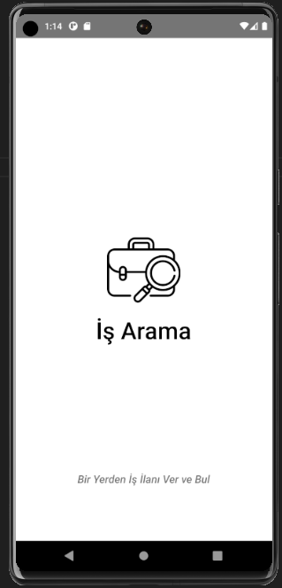
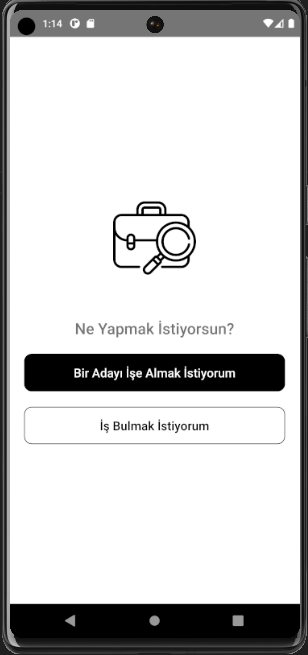
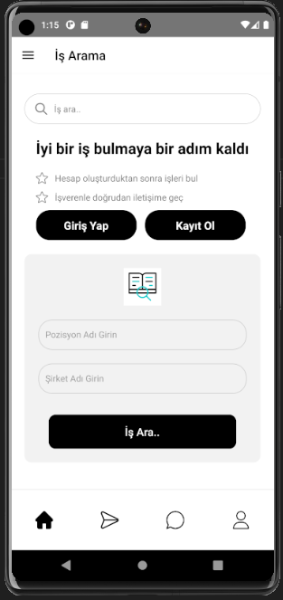
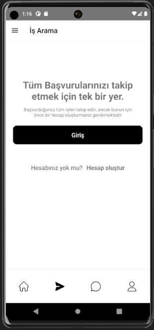
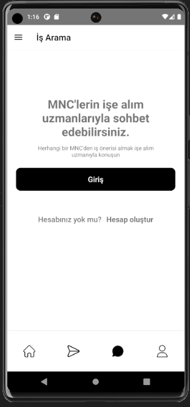
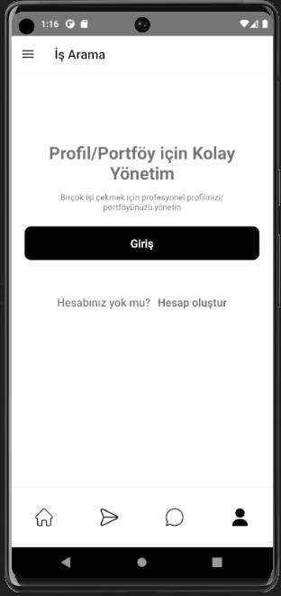
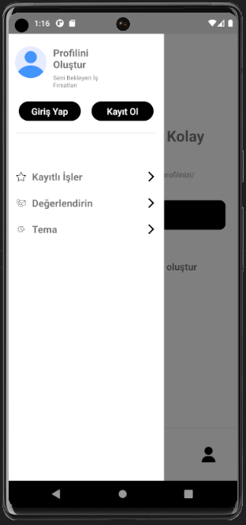
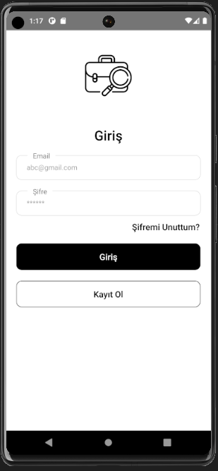
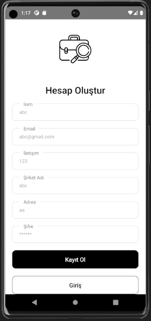

# İş İlan Uygulaması

Bu proje, kullanıcıların iş ilanlarını listelemesine ve yönetmesine olanak tanıyan bir mobil uygulamadır. İş arayanlar, iş ilanlarını görüntüleyebilir ve ilgilendikleri işlere başvurabilirken, iş verenler ise kendi iş ilanlarını oluşturabilir ve yönetebilirler.

## Ekranlar

### Ana Ekran

Ana ekran, kullanıcıya iş ilanlarını listeleyen bir sayfadır. Kullanıcılar burada mevcut iş ilanlarını görüntüleyebilir, ilanlara başvuruda bulunabilir ve ilanları filtreleyebilirler.

### İlan Detay Ekranı

İlan detay ekranı, seçilen bir iş ilanının detaylarını gösteren bir sayfadır. Kullanıcılar burada ilanın başlığı, açıklaması, gereken deneyim, maaş gibi bilgileri görüntüleyebilir ve ilana başvuruda bulunabilirler.

### İlan Oluşturma Ekranı

İlan oluşturma ekranı, iş verenlerin yeni bir iş ilanı oluşturmasını sağlayan bir form sayfasıdır. İş verenler burada iş ilanının başlığını, açıklamasını, gereken deneyimi, maaş bilgisini vb. girebilirler.

### İlan Düzenleme Ekranı

İlan düzenleme ekranı, iş verenlerin mevcut bir iş ilanını düzenlemesine olanak tanır. İş verenler burada ilanın bilgilerini güncelleyebilirler.

### Profil Ekranı

Profil ekranı, kullanıcıların kişisel bilgilerini görüntüleyebileceği ve düzenleyebileceği bir sayfadır. Kullanıcılar burada adlarını, profil fotoğraflarını vb. görebilir ve güncelleyebilirler.

## Teknolojiler ve Kütüphaneler

- **React Native:** Mobil uygulama geliştirmek için kullanılan bir JavaScript kütüphanesidir.
- **Firebase Firestore:** Bulut tabanlı bir NoSQL veritabanıdır ve bu proje için iş ilanlarını saklamak ve yönetmek için kullanılmıştır.
- **AsyncStorage:** React Native uygulamalarında yerel depolama yönetimini sağlar.
- **react-native-shimmer-placeholder:** Placeholder bileşeni oluşturmak için kullanılan bir kütüphanedir, veriler yüklenirken kullanıcıya bir yükleme göstergesi sunar.

---

## Ekran Görüntüleri

