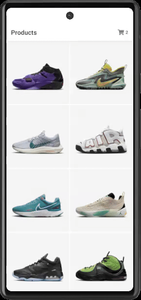

# Nike Clone Projesi

Bu proje, React Native ve Redux Toolkit kullanılarak geliştirilmiş basit bir Nike klon uygulamasını içermektedir.

## Açıklama

Bu uygulama, Nike mağazasının basit bir klonudur. Kullanıcılar, uygulama içindeki ürünleri listeleyebilir, detaylarını inceleyebilir, alışveriş sepetine ürün ekleyebilir ve ödeme işlemini tamamlayabilirler.

## İçerik

- **Ana Ekran**: Ürünlerin listelendiği sayfa.
- **Ürün Detayları Ekranı**: Seçilen ürünün detaylarının gösterildiği sayfa.
- **Alışveriş Sepeti Ekranı**: Eklenen ürünlerin listelendiği ve ödeme işleminin yapılabildiği sayfa.
  **Ödeme Ekranı**: Sepetteki ürünlerin alışverişi için gerekli olan tutarın ödeneceği kart bilgilerinin girişi yapılacak sayfa.

## Kullanım

1-Uygulamayı emülatörde veya fiziksel cihazda çalıştırın.

2-Ana ekran üzerinden ürünleri inceleyin, detayları görüntüleyin ve alışveriş sepetinizi yönetin.

3-"Alışverişi Tamamla" ekranı üzerinden ödeme işlemini gerçekleştirin.

## Kullanılan Teknolojiler

- React Native
- Redux Toolkit
- React Navigation
- Diğer bağımlılıklar için package.json dosyasına göz atın.

## Gif

