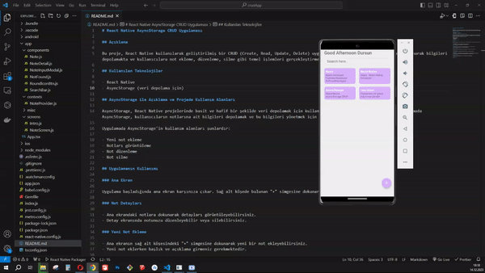

# React Native AsyncStorage CRUD Uygulaması

## Açıklama

Bu proje, React Native kullanılarak geliştirilmiş bir CRUD (Create, Read, Update, Delete) uygulamasıdır. Uygulama, AsyncStorage kullanarak bilgileri depolamakta ve kullanıcılara not ekleme, düzenleme, silme gibi temel işlemleri gerçekleştirme imkanı sunmaktadır.

## Kullanılan Teknolojiler

- React Native
- AsyncStorage (veri depolama için)

## AsyncStorage ile Açıklama ve Projede Kullanım Alanları

AsyncStorage, React Native projelerinde basit ve hafif bir şekilde veri depolamak için kullanılan yerel depolama çözümüdür. Bu uygulamada AsyncStorage, kullanıcıların notlarına ait bilgileri depolamak ve bu bilgileri yönetmek için kullanılmıştır.

Uygulamada AsyncStorage'in kullanım alanları şunlardır:

- Yeni not ekleme
- Notları görüntüleme
- Not düzenleme
- Not silme

## Uygulamanın Kullanımı

### Ana Ekran

Uygulama başladığında ana ekran karşınıza çıkar. Sağ alt köşede bulunan "+" simgesine dokunarak yeni bir not ekleyebilirsiniz.

### Not Detayları

- Ana ekrandaki notlara dokunarak detayları görüntüleyebilirsiniz.
- Detay ekranında notunuzu düzenleyebilir veya silebilirsiniz.

### Yeni Not Ekleme

- Ana ekranın sağ alt köşesindeki "+" simgesine dokunarak yeni bir not ekleyebilirsiniz.
- Yeni not eklerken başlık ve açıklama girmeniz gerekmektedir.

### Notları Düzenleme

- Ana ekrandaki notlara dokunarak detay ekranına gidebilir ve notunuzu düzenleyebilirsiniz.

### Notları Silme

- Ana ekrandaki notlara dokunarak detay ekranına gidebilir ve notunuzu silebilirsiniz.

### Arama Yapma

- Ana ekranın sağ üst köşesindeki arama simgesine dokunarak notlar arasında filtreleme yapabilirsiniz.
- Arama çubuğuna bir kelime veya ifade yazarak ilgili notları listeleyebilirsiniz.

### Uygulamadan Çıkma

- Uygulamadan çıktığınızda eklediğiniz notlar AsyncStorage üzerinde depolanır.

## Canlı Önizleme

