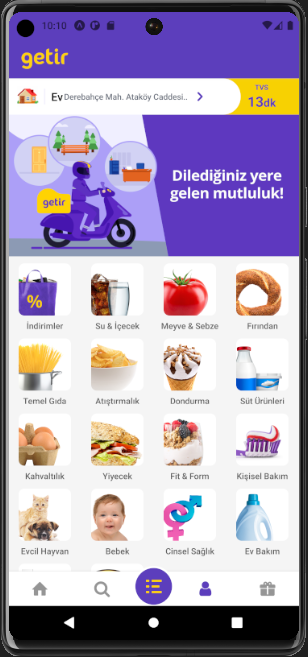
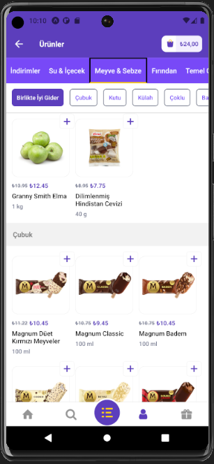
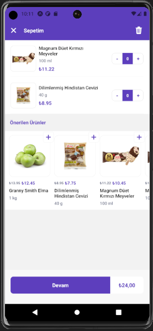
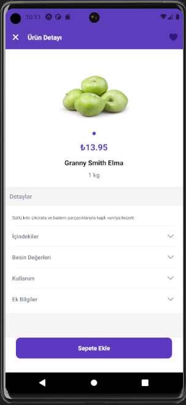

# Getir Uygulaması Klonu

Bu proje, Getir uygulamasının bir klonunu oluşturmayı amaçlamaktadır. React Native kullanılarak geliştirilmiştir ve Firebase ile entegre edilmiştir.

## Proje Hakkında

Bu proje, Getir uygulamasının temel özelliklerini taklit eden bir mobil uygulamayı içermektedir. İşlevselliği, kullanıcıların kayıt olması, giriş yapması, ürünleri listeleyebilmesi, sepete ekleyebilmesi ve sipariş verebilmesi şeklinde özetlenebilir.

## Kullanılan Teknolojiler

Proje aşağıdaki teknolojileri kullanmaktadır:

- **React Native:** Mobil uygulama geliştirmek için kullanılan açık kaynak bir framework.
- **Redux:** Durum yönetimi için kullanılan bir JavaScript kütüphanesi.
- **Firebase:** Oturum açma, kullanıcı yönetimi ve gerçek zamanlı veritabanı için kullanılan bir platform.
- **React Navigation:** Navigasyon yönetimi için kullanılan bir kütüphane.

## Sayfalar

### Ana Sayfa

Ana sayfa, uygulamanın giriş ekranını içerir. Kullanıcılar burada ürünleri listeleyebilir ve sepetlerine ürün ekleyebilirler.

### Giriş ve Kayıt Sayfaları

Giriş ve kayıt sayfaları, kullanıcıların uygulamaya giriş yapması veya kayıt olması için kullanılır. Firebase Authentication kullanılarak sağlanmaktadır.

### Sepet Sayfası

Sepet sayfası, kullanıcıların sepet içeriğini gösterir. Kullanıcılar buradan siparişlerini tamamlayabilirler.

### Profil Sayfası

Profil sayfası, kullanıcıların hesap bilgilerini ve sipariş geçmişini görüntüleyebilecekleri bir sayfadır.

## Proje Görüntüsü

