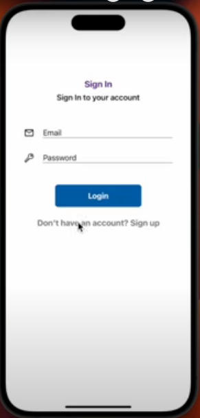
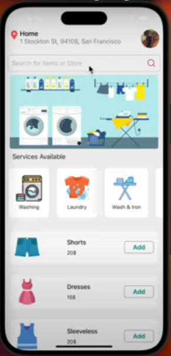
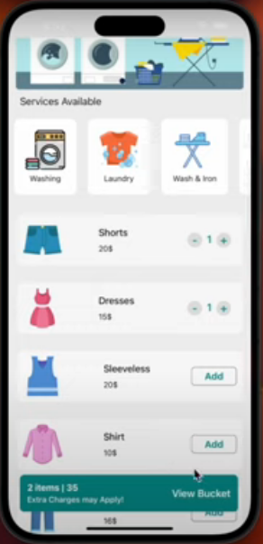
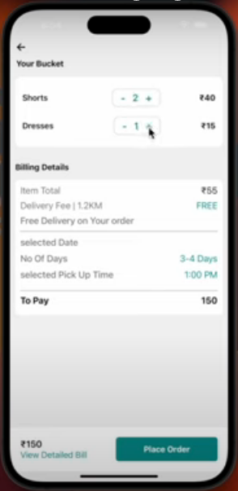

# E-Ticaret Mobil Uygulaması

Bu proje, kullanıcıların çeşitli giyim ürünleri arasından seçim yapabildikleri bir e-ticaret mobil uygulamasını geliştirmektedir. Proje kapsamında, kullanıcıların kayıt olmaları, giriş yapmaları, ürünleri incelemeleri ve sepete eklemeleri gibi temel e-ticaret işlemleri bulunmaktadır.

## Projenin Bileşenleri ve Açıklamaları

### Giriş Ekranı (LoginScreen.js)

Bu ekran, kullanıcıların uygulamaya giriş yapmaları için kullanılır. Firebase Authentication ile entegre edilmiş olup, kullanıcı bilgileri kontrol edilir ve geçerliyse ana ekrana yönlendirilir.

### Kayıt Ekranı (RegisterScreen.js)

Yeni kullanıcıların kayıt olmalarını sağlayan ekran. Kullanıcıdan email, şifre ve telefon bilgilerini alır. Firebase Auth kullanılarak kayıt işlemi gerçekleştirilir ve kullanıcının bilgileri Firestore veritabanında saklanır.

### Ana Ekran (HomeScreen.js)

Uygulamanın ana ekranıdır. Kullanıcının konumu ve profili gösterilir. Ayrıca, kullanıcının seçtiği giyim ürünleri, kategorilere ayrılmış şekilde listelenir. Ürünlerin detaylarına ve sepete ekleme işlemlerine olanak tanır.

### Firebase Entegrasyonu

Firebase, bu projede kimlik doğrulama (Authentication) ve veritabanı (Firestore) için kullanılmaktadır. Kullanıcı bilgileri güvenli bir şekilde saklanır ve kimlik doğrulama işlemleri Firebase Authentication üzerinden yönetilir.

### Redux Kullanımı

Redux Toolkit, global durum yönetimi için kullanılmıştır. Özellikle, kullanıcının sepetindeki ürünleri ve toplam fiyatı global bir şekilde saklamak için Redux kullanılmıştır.

### Konum Servisleri (Location Services)

Expo Location, kullanıcının konum bilgisini almak ve konumla ilgili işlemleri gerçekleştirmek için kullanılmıştır. Kullanıcının bulunduğu konum, uygulamada "Home" ekranında gösterilir.

### Carousel ve Diğer Bileşenler

Proje içerisinde resim geçiş efektleri (Carousel) ve diğer özel bileşenler kullanılmıştır. Bu bileşenler, uygulamanın görsel açıdan çekici olmasına katkı sağlar.

## Kullanılan Teknolojiler

- **React Native:** Mobil uygulama geliştirmek için kullanılan bir JavaScript kütüphanesidir.
- **Firebase:** Kullanıcı yetkilendirmesi (Firebase Auth) ve veritabanı (Firestore) için kullanılan bir platformdur.
- **Redux Toolkit:** Global durumu yönetmek için kullanılan bir Redux kütüphanesidir.
- **Expo:** React Native projelerini geliştirmek ve dağıtmak için kullanılan bir çerçevedir.
- **Expo Location:** Kullanıcının konumunu almak ve yönetmek için kullanılan bir Expo servisidir.
- **React Navigation:** Mobil uygulamalarda gezinme işlemlerini yönetmek için kullanılan bir kütüphanedir.

Bu teknolojiler, projenin temel yapısını oluşturmak ve mobil uygulama geliştirmek için kullanılmıştır. Her teknoloji, projenin belirli bir yönünü desteklemek için seçilmiştir.

## Ekran Görüntüleri

