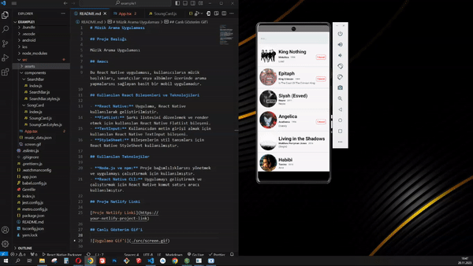

# Müzik Arama Uygulaması

## Proje Başlığı

Müzik Arama Uygulaması

## Amacı

Bu React Native uygulaması, kullanıcıların müzik başlıkları, sanatçılar veya albümler üzerinde arama yapmalarını sağlayan basit bir mobil uygulamadır.

## Kullanılan React Bileşenleri ve Teknolojileri

- **React Native:** Uygulama, React Native kullanılarak geliştirilmiştir.
- **FlatList:** Şarkı listesini düzenlemek ve render etmek için kullanılan React Native FlatList bileşeni.
- **TextInput:** Kullanıcıdan metin girişi almak için kullanılan React Native TextInput bileşeni.
- **StyleSheet:** Bileşenlerin stil tanımları için React Native StyleSheet kullanılmıştır.

## Kullanılan Teknolojiler

- **Node.js ve npm:** Proje bağımlılıklarını yönetmek ve uygulamayı çalıştırmak için kullanılmıştır.
- **React Native CLI:** Uygulamayı geliştirmek ve çalıştırmak için React Native komut satırı aracı kullanılmıştır.

## Proje Netlify Linki

[Proje Netlify Linki](https://your-netlify-project-link)

## Canlı Gösterim Gif'i

