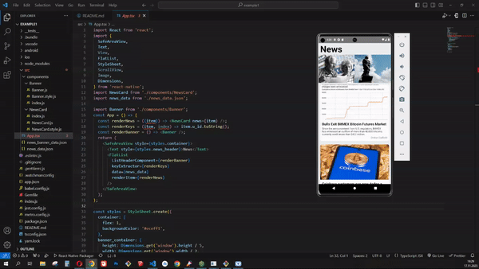

# React Native News App

## Amaç

Bu basit haber uygulaması, kullanıcılara haber başlıklarını, açıklamalarını, ve görsellerini görüntüleme imkanı sunar. Ayrıca, haberlere daha dikkat çekici bir şekilde odaklanmak için bir banner bölümü içerir.

## Kullanılan React Native Bileşenleri ve Teknolojiler

- **SafeAreaView:** Güvenli bir görüntüleme alanı sağlar.
- **Text:** Metin içeriği için kullanılır.
- **View:** Genel bir bileşen konteyneri.
- **FlatList:** Liste görünümleri oluşturmak ve verileri düzenlemek için kullanılır.
- **ScrollView:** Kaydırılabilir içerik oluşturmak için kullanılır.
- **Image:** Görselleri göstermek için kullanılır.
- **StyleSheet:** Stilleri tanımlamak ve yönetmek için kullanılır.
- **Dimensions:** Cihazın ekran boyutlarını almak için kullanılır.
- **news_data.json** ve **news_banner_data.json:** Haber ve banner verilerini içeren JSON dosyaları.

## Proje Netlify Linki

[Proje Netlify Linki](https://your-netlify-project-link)

## Canlı Gösterim Gif'i

