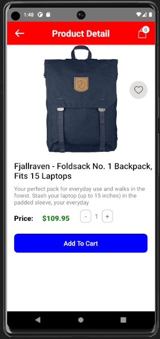
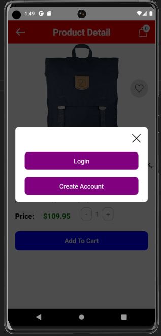
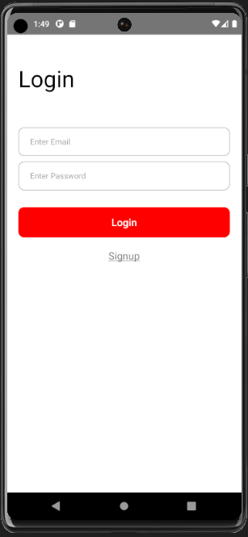
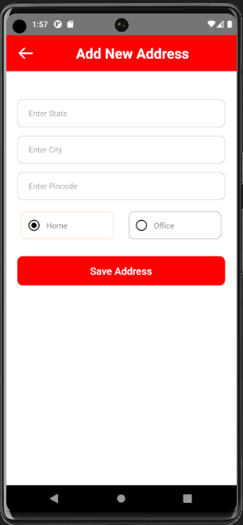
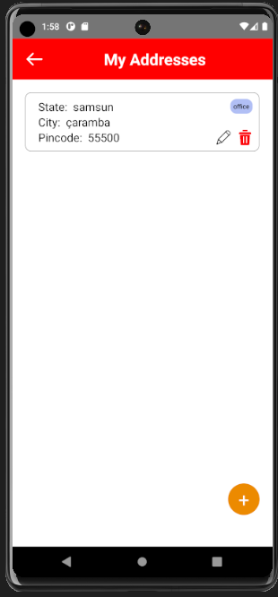
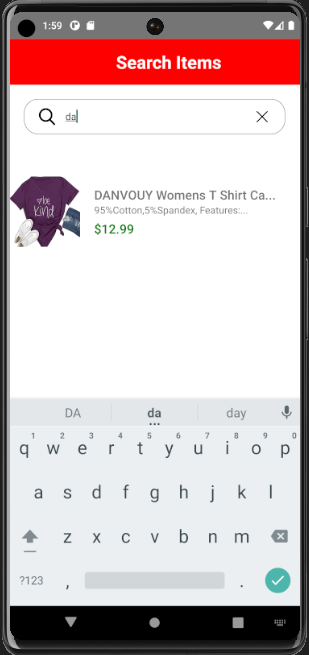

# ShopsHub Alışveriş Uygulaması

ShopsHub, kullanıcıların online alışveriş yapabildiği bir React Native projesidir. Bu uygulama, fake API ve Firebase entegrasyonu ile kullanıcılara alışveriş deneyimi sunar.

## Sayfalar ve İşlemler

### 1. Giriş Yapma Sayfası

- Kullanıcılar, e-posta ve şifreleri ile giriş yapabilirler.
- Firebase Authentication entegrasyonu ile giriş bilgileri kontrol edilir.
- Başarılı giriş durumunda kullanıcı ana sayfaya yönlendirilir.

### 2. Ana Sayfa

- Ürünlerin listelendiği ana ekran.
- Her ürün, detaylarına yönlendiren bir bağlantıya sahiptir.

### 3. Ürün Detay Sayfası

- Seçilen ürünün detaylarını içerir.
- Sepete ekleme butonu ile ürün sepete eklenir.

### 4. Sepet Sayfası

- Kullanıcının sepetindeki ürünlerin listelendiği sayfa.
- Her ürün, miktarını güncelleme ve sepetten çıkarma seçeneklerine sahiptir.

### 5. Adresler Sayfası

- Kullanıcının kayıtlı adreslerini listeler.
- Yeni adres ekleyebilir ve mevcut adresleri düzenleyebilir.

### 6. Yeni Adres Ekleme Sayfası

- Kullanıcı yeni bir adres ekleyebilir.
- Adres türü (Ev, İş) seçilebilir.

## Kullanılan Teknolojiler

1. **React Native**: Mobil uygulamanın geliştirilmesinde kullanılan temel çerçeve.

2. **Firebase**: Gerçek zamanlı veritabanı ve kimlik doğrulama işlemleri için kullanılmıştır.

3. **React Navigation**: Uygulamadaki gezinme işlemleri için kullanılan bir kütüphane.

4. **Redux Toolkit ve React Redux**: Uygulamadaki durum yönetimi için kullanılan bir yönetim aracı ve React ile Redux entegrasyonu.

5. **AsyncStorage**: Mobil cihazda yerel depolama kullanımını kolaylaştırmak için kullanılmıştır.

6. **Axios**: HTTP istekleri yapmak için kullanılan bir kütüphane. Fake API ile iletişim kurmak için kullanılmıştır.

7. **Razorpay (react-native-razorpay)**: Ödeme işlemleri için entegre edilen bir kütüphane.

Bu teknolojiler, projenin geliştirilmesi ve kullanıcılarına daha iyi bir deneyim sunabilmesi için kullanılmıştır.

## Ekran Görüntüleri

