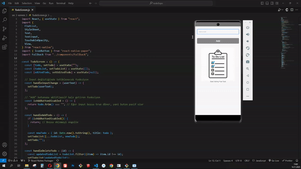

# React Native Todo List Uygulaması

## Açıklama

Bu basit React Native Todo List uygulaması, kullanıcıların görev eklemelerine, düzenlemelerine, silmelerine ve görev listesini görüntülemelerine olanak tanır.

## Kullanım

Uygulamayı kullanmak oldukça basittir. İşte adım adım nasıl kullanılacağı:

### Görev Ekleme:

1. Ana ekrandaki metin giriş kutusuna eklemek istediğiniz görevi yazın.
2. "**Add**" butonuna tıklayarak görevi listeye ekleyin.

### Görev Düzenleme:

1. Var olan bir görevi düzenlemek istiyorsanız, görevin üzerindeki "**kalem**" simgesine tıklayın.
2. Metin giriş kutusundaki mevcut görevi düzenleyin.
3. "**Save**" butonuna tıklayarak değişiklikleri kaydedin.

### Görev Silme:

1. Bir görevi silmek için, görevin yanındaki "**çöp kutusu**" simgesine tıklayın.
2. Silme işlemi onaylandığında görev listeden kaldırılır.

### Görev Listesini Görüntüleme:

- Eklenen görevleri görmek için ana ekrandaki liste bölümünü kullanın.
- Liste boşsa veya görev eklenmediyse, ekranda bir **Fallback** görüntülenir.

### Dikkat Edilmesi Gerekenler:

- Görev eklerken boş bir giriş yapamazsınız. "**Add**" butonu boş girişlerde pasif olacaktır.
- Düzenleme yaparken de aynı kural geçerlidir.

Uygulama bu temel adımlar üzerine inşa edilmiştir. İhtiyacınıza göre görev ekleyebilir, düzenleyebilir ve silebilirsiniz. Keyifli kullanımlar!

## Kullanılan Teknolojiler

- React Native
- Expo CLI
- React Navigation
- React Native Paper
- React Native UUID

## Netlify Linki

[Proje Netlify Linki](https://todo-reactnative.netlify.app)

## Gif

