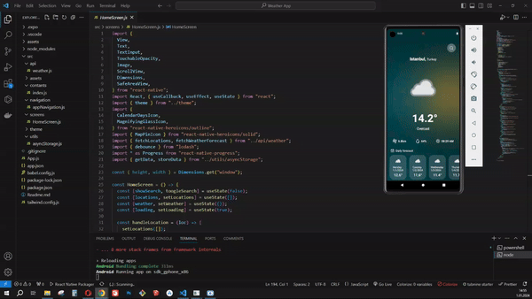

# Weather App

Bu proje, hava durumu bilgilerini gösteren bir mobil uygulamayı içerir. Kullanıcılar, şehir arayarak hava durumu tahminlerini görebilir ve haftalık tahminlere göz atabilirler.

## Kullanılan Teknolojiler

- **Redux Native:** Mobil uygulama geliştirmek için kullanılan bir JavaScript çerçevesi.
- **React Navigation:** Ekran yönetimi ve gezinme için kullanılmaktadır.
- **Axios:** HTTP istekleri yapmak için kullanılmaktadır.
- **WeatherApı:** Hava durumu verilerini sağlamak için kullanılan bir API.
- **AsyncStorage:** Verileri yerel depolama alanında saklamak için kullanılan bir modül.
- **React Native Heroicons:** UI için ikonlar sağlamak için kullanılmaktadır.
- **React Native Progress:** İlerleme çemberini göstermek için kullanılan bir kütüphane.
- **React Native Linear Gradient:** Arka plana gradient eklemek için kullanılmaktadır.

## Nasıl Kullanılır

Uygulama başladığında, kullanıcı hoş geldin ekranını görecektir. Ardından, üst kısımdaki arama simgesine tıklayarak bir şehir arayabilir ve hava durumu tahminlerini görebilir. Eğer bir şehir adı yazarsanız, uygulama bu şehir için hava durumu bilgilerini WeatherAPI üzerinden getirecektir.

## Gif

